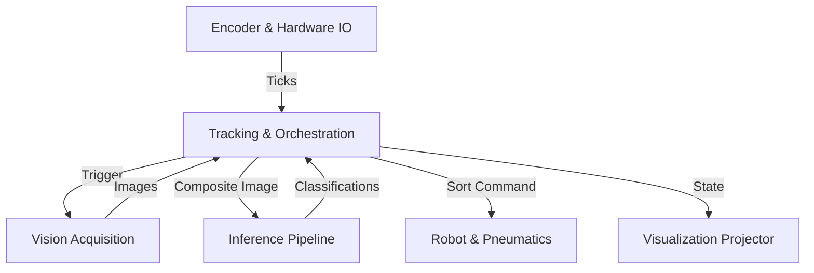

# Architecture Map

## System Overview

The **Cherry Processing System** is a distributed, real-time sorting machine built on ROS2. It coordinates high-speed imaging, deep learning inference, and physical actuation to sort cherries based on pit detection.

## Navigation Map

## Module Directory

| Layer | Responsibility | Directory |
|-------|----------------|-----------|
| **[System Overview](./system_overview/ARCHITECTURE.md)** | Global data flow, `cherry_interfaces`, and high-level design constraints. | `docs/core/architecture/system_overview/` |
| **[Hardware I/O](./hardware_io/ARCHITECTURE.md)** | Physical interfacing: Encoders, Strobes, Pneumatics, Digital I/O. | `docs/core/architecture/hardware_io/` |
| **[Vision Acquisition](./vision_acquisition/ARCHITECTURE.md)** | Camera drivers (`avt_vimba`), image capture, and synchronization. | `docs/core/architecture/vision_acquisition/` |
| **[Inference Pipeline](./inference_pipeline/ARCHITECTURE.md)** | Deep learning models (Mask R-CNN, ResNet50), training workflows, and detection services. | `docs/core/architecture/inference_pipeline/` |
| **[Tracking & Orchestration](./tracking_orchestration/ARCHITECTURE.md)** | The Brain: `control_node`, belt tracking logic, robot comms, and visualization. | `docs/core/architecture/tracking_orchestration/` |

## Discovery Protocol
**Agents:** Do not read all files.
1. Identify the layer relevant to your task from the table above.
2. Read the `ARCHITECTURE.md` in that specific directory.
3. Follow "Discovery Links" within that module to find specific code or reference docs.
